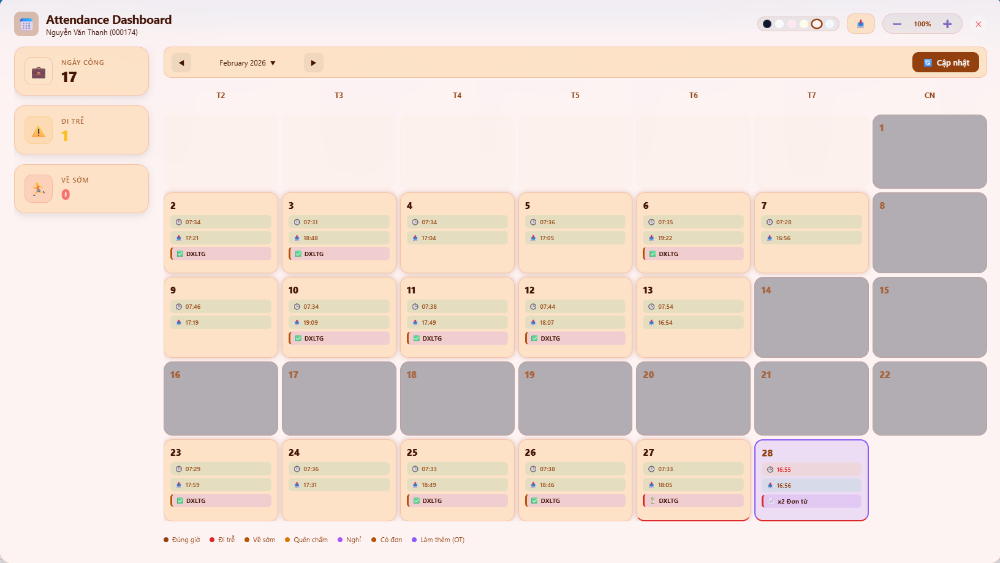
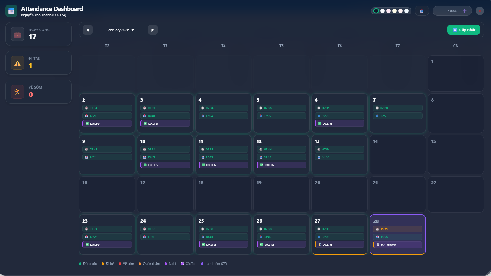
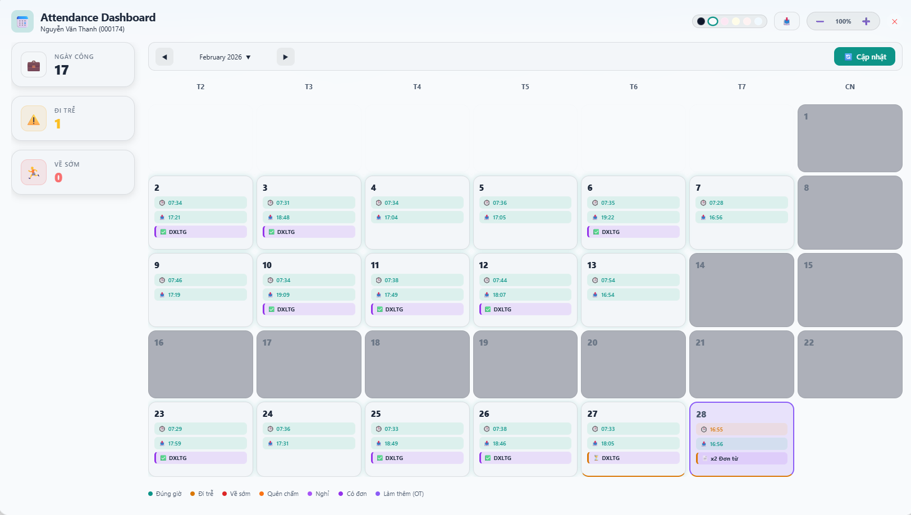
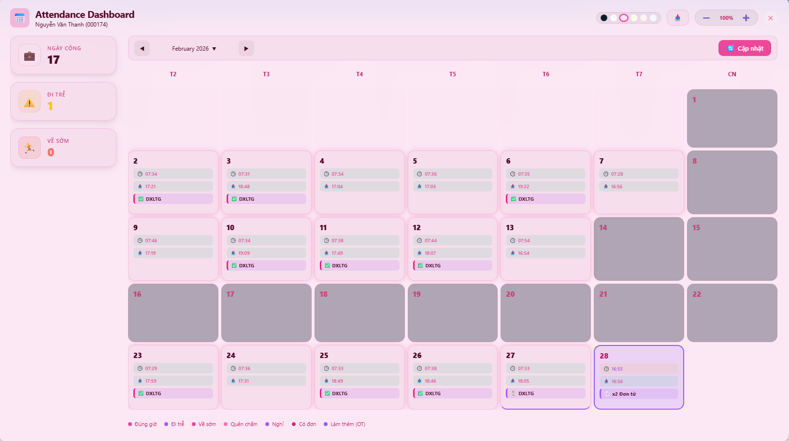
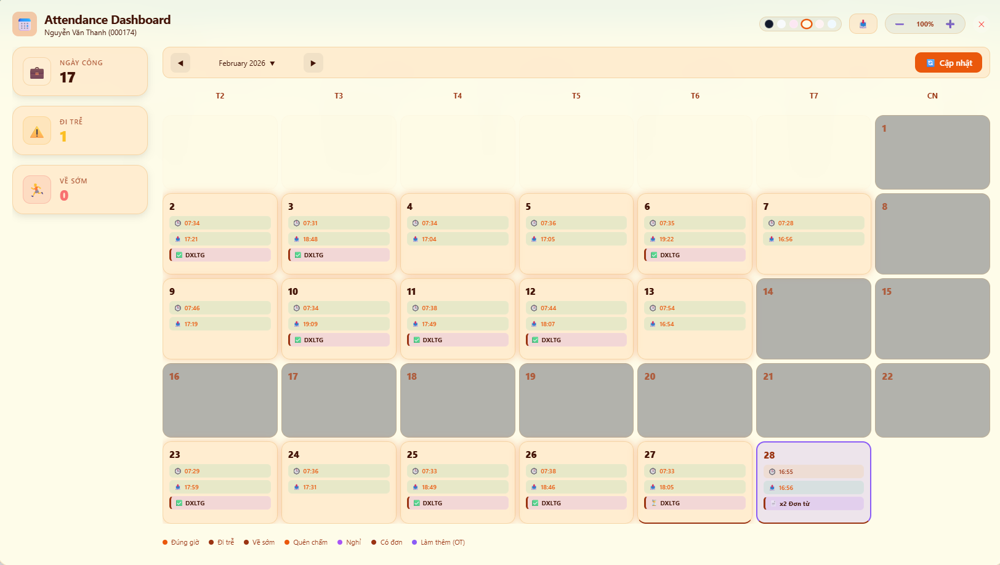
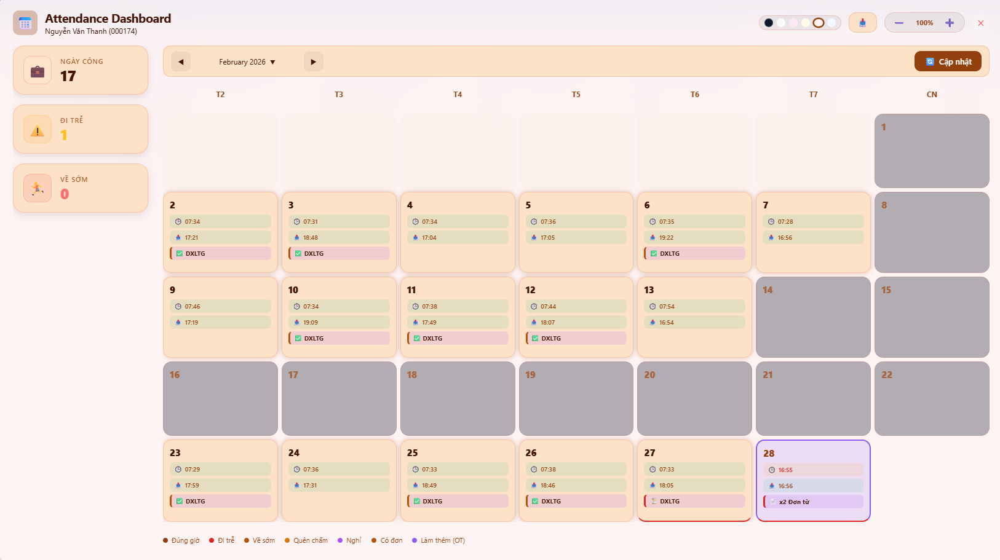
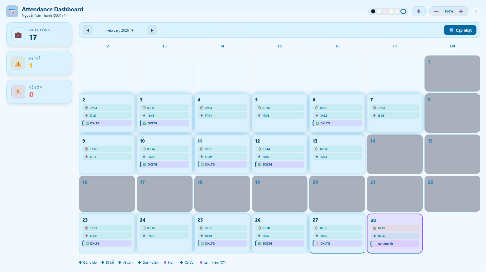
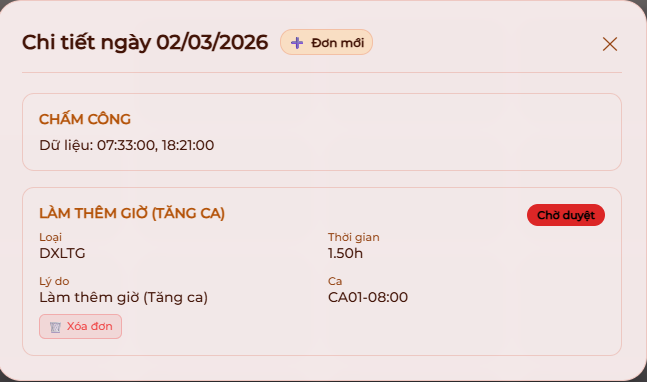

# 📅 Asoft Attendance Dashboard Extension v2.0

**Asoft Attendance Extension** là một giải pháp quản lý công và đơn từ cao cấp, được thiết kế để mang lại trải nghiệm người dùng hiện đại và thông minh ngay trên nền tảng HRM hiện có. Với ngôn ngữ thiết kế **Glass Morphism** và trí tuệ nhân tạo tích hợp, việc quản lý thời gian chưa bao giờ dễ dàng và đẹp mắt đến thế.

---

# Tải về extension

---
[Tải về asoft-attendance-v2.0.zip](asoft-attendance-v2.0.zip)

---

## 📽️ Video Demo Trải Nghiệm
Khám phá toàn bộ tính năng và sự mượt mà của giao diện thông qua video dưới đây:

*(Nếu bạn không xem được video, hãy [nhấn vào đây](attendance-extension/video/demo.mp4) để tải hoặc xem trực tiếp)*

---

## 🔥 Các Tính Năng Đột Phá

### 1. 🧠 Smart Suggestion Logic (Gợi ý Thông minh)
Không còn phải tự mình tính toán giờ giấc hay chọn loại đơn phức tạp. Hệ thống tự động phân tích:
- **Đi trễ/Về sớm**: Tự động gợi ý bổ sung vân tay hoặc đổi ca (DXDC) phù hợp nhất với giờ quẹt thực tế.
- **Quên quẹt thẻ**: Tự động nhận diện buổi (Sáng/Chiều) để gợi ý bổ sung giờ Vào/Ra.
- **Làm thêm giờ (OT)**: Tự động tính toán số giờ OT dựa trên checkout thực tế và làm tròn xuống block 15 phút an toàn.
- **Nghỉ phép**: Tự động nhận diện ngày vắng mặt để gợi ý đơn xin nghỉ.

### 2. 🎨 Hệ Thống Theme Đa Dạng (6 Styles)
Tùy biến không gian làm việc theo sở thích với 6 bộ giao diện được tối ưu hóa độ tương phản và thẩm mỹ:

| 🌑 Dark Mode | ☀️ Light Mode | 🌸 Spring Theme |
| :---: | :---: | :---: |
|  |  |  |

| 🌻 Summer Theme | 🍂 Autumn Theme | ❄️ Winter Theme |
| :---: | :---: | :---: |
|  |  |  |

### 3. 📊 Tương Tác Dữ Liệu Trực Quan
- **Highlight theo thẻ**: Nhấn vào các chỉ số "Nghỉ", "Trễ", "Sớm" ở Sidebar để lịch tự động làm nổi bật các ngày vi phạm tương ứng.
- **Bộ chọn Tháng/Năm Premium**: Điều hướng thời gian nhanh chóng với giao diện popup hiện đại thay vì dropdown mặc định nhàm chán.
- **Xuất dữ liệu**: Hỗ trợ xuất báo cáo ngay lập tức cho tháng hiện tại.

---

## 🛠️ Chi Tiết Chức Năng

| Chức năng | Minh họa | Đặc điểm |
| :--- | :---: | :--- |
| **Chi tiết ngày** |  | Hiển thị đầy đủ giờ quẹt thẻ, tên ca, trạng thái đơn từ trong ngày. |
| **Tạo đơn mới** |  | Giao diện form điền sẵn (Auto-fill) thông minh, hỗ trợ tìm kiếm người duyệt nhanh. |
| **Quản lý đơn** |  | Xem trạng thái duyệt và cho phép xóa đơn trực tiếp ngay tại popup chi tiết. |
| **Chọn tháng** |  | Popup chọn tháng trực quan, hỗ trợ quay lại năm nhanh và chuyển về "Hôm nay". |

---

## 💻 Công Nghệ & Kiến Trúc
Dự án được xây dựng với tiêu chí hiệu năng cao và không phụ thuộc thư viện bên ngoài:
- **Core**: Vanilla JavaScript (ES6+) tối ưu tốc độ xử lý DOM.
- **Styling**: CSS Variables kết hợp Backdrop Filter cho hiệu ứng kính mờ (Glass Morphism).
- **Storage**: `chrome.storage.sync` & `localStorage` để đồng bộ cấu hình người dùng (vị trí, kích thước, theme, zoom).
- **Communication**: Interceptor API để giao tiếp mượt mà với backend ASP.NET HRM.

---

## 🚀 Hướng Dẫn Cài Đặt (Developer Mode)

Cài đặt extension vô cùng đơn giản trong 4 bước:

1. **Bước 1**: Truy cập quản lý Extension trên Edge/Chrome thông qua đường dẫn `edge://extensions`.
2. **Bước 2**: Bật **Developer mode** (Chế độ nhà phát triển) ở góc màn hình.
3. **Bước 3**: Nhấn nút **Load unpacked** (Tải bản tiện ích đã giải nén).
4. **Bước 4**: Chọn thư mục `attendance-extension/` trong máy tính của bạn.

*(Lưu ý: Luôn login vào hệ thống HRM trước khi sử dụng extension)*

---

**Made with ❤️ by Syo & Antigravity for Asoft HRM Efficiency**