# 📅 Asoft Attendance Dashboard Dashboard v2.5

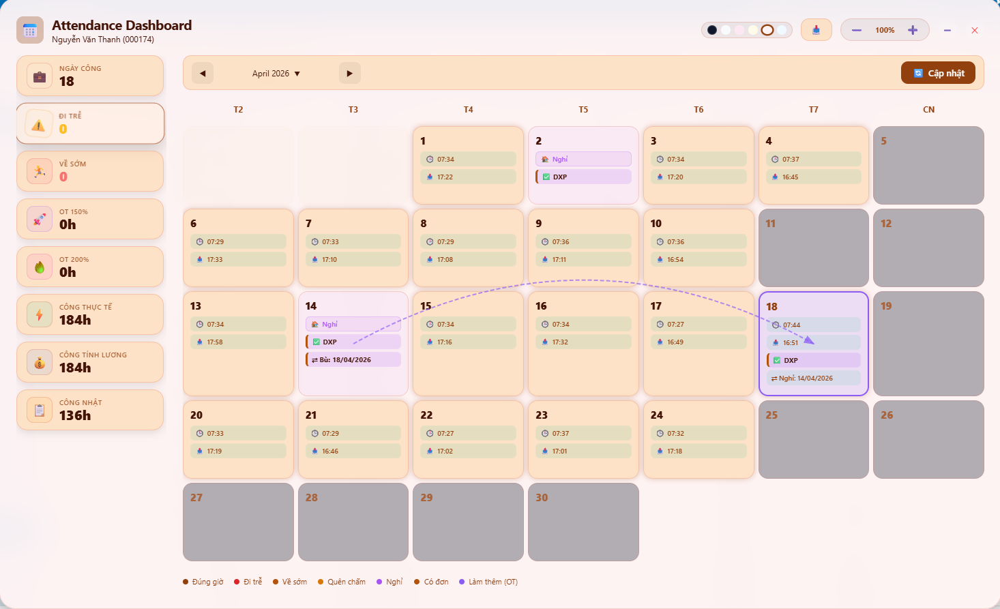

**Asoft Attendance Extension** là một giải pháp quản lý công và đơn từ cao cấp, được thiết kế để mang lại trải nghiệm người dùng hiện đại và thông minh ngay trên nền tảng HRM hiện có. Với ngôn ngữ thiết kế **Glass Morphism** và trí tuệ nhân tạo tích hợp, việc quản lý thời gian chưa bao giờ dễ dàng và đẹp mắt đến thế.

---

# Tải về extension

---
[Tải về asoft-attendance-v2.5.zip](asoft-attendance-v2.5.zip)

---

## 📽️ Video Demo Trải Nghiệm
Khám phá toàn bộ tính năng và sự mượt mà của giao diện thông qua video dưới đây:

*(Nếu bạn không xem được video, hãy [nhấn vào đây](video/demo.mp4) để tải hoặc xem trực tiếp)*

---

## 🆕 Changelog

### v2.5 — 2026-05-07
> **Tự động hóa Release & Quản lý Mã nguồn**

- 🚀 **Release Tool (PowerShell)**: Triển khai công cụ `release.ps1` giúp tự động hóa quy trình đóng gói và phát hành.
- 📦 **GitHub Release Integration**: Tự động tạo bản Release trên GitHub và upload file zip đính kèm thông qua API.
- 🔐 **Security**: Tích hợp quản lý thông tin xác thực qua file `.env` và bảo mật với `.gitignore`.

### v2.4 — 2026-05-07
> **Mở rộng Dashboard & Tối ưu Trải nghiệm**

- 📊 **Bổ sung 3 thẻ thống kê mới**: Tích hợp dữ liệu từ báo cáo `HRMT2320` để hiển thị **Công thực tế**, **Công tính lương** và **Công nhật**.
- 🤏 **Tính năng Minimize (Thu nhỏ)**: Cho phép thu gọn dashboard thành một thanh biểu tượng (pill bar) nhỏ gọn để tiết kiệm diện tích màn hình.
- ⚡ **Tối ưu hiển thị Stats Panel**: 
  - Thiết kế lại các thẻ thống kê nhỏ gọn hơn, phù hợp với nhiều độ phân giải.
  - Hỗ trợ cuộn dọc (`scroll`) tự động khi danh sách chỉ số vượt quá chiều cao màn hình.
- 🔧 **Cải thiện UI/UX**: Tinh chỉnh khoảng cách, icon và hiệu ứng chuyển cảnh mượt mà hơn.

### v2.3 — 2026-04-18
> **Tính năng Bù Phép Drag-Drop hoàn chỉnh**

- ✨ **Drag-Drop Bù Phép (Comp Swap)**: Kéo một ngày OT (làm cuối tuần/lễ) thả vào ngày làm việc để tự động mở form và gửi đồng thời 2 đơn liên kết:
  - **Đơn 1 — NP** (Nghỉ phép năm): cho ngày được nghỉ bù.
  - **Đơn 2 — BN** (Làm bù công nhật): cho ngày đi làm thêm.
- 🔗 **Mã liên kết `[pairId]` trong lý do đơn**: `pairId` được tạo ngay khi mở modal và nhúng vào trường *Lý do* của cả 2 đơn — đảm bảo truy ngược được liên kết trực tiếp từ server mà không phụ thuộc hoàn toàn vào local storage.
- 🗺️ **Hiển thị mũi tên liên kết SVG** trên lịch: sau khi gửi đơn, 2 ngày được nối với nhau bằng đường cong có mũi tên (dashed arc) màu tím, giúp nhận biết cặp ngày nghỉ/làm bù ngay trên giao diện.
- 🗑️ **Tự động xóa liên kết khi xóa đơn**: khi xóa đơn NP hoặc BN thành công, hệ thống tự động tìm và xóa entry tương ứng trong `chrome.storage.sync` — mũi tên và badge trên lịch biến mất ngay sau khi reload.

### v2.2 — trước đó
- Các tính năng cũ giữ nguyên (xem chi tiết bên dưới).

---

## 🔥 Các Tính Năng Đột Phá

### 1. 🔄 Bù Phép Drag-Drop *(Mới v2.3)*
Không cần mở nhiều form thủ công. Chỉ cần **kéo ngày OT** (cuối tuần/lễ đã làm) và **thả vào ngày muốn nghỉ bù**:
- Hệ thống mở modal xác nhận với 2 card: *Đơn NP* cho ngày nghỉ và *Đơn BN* cho ngày làm bù.
- Tự động điền ca làm việc, số giờ, lý do kèm **mã liên kết duy nhất** `[pairId]`.
- Gửi tuần tự 2 đơn lên server, xử lý retry khi trùng ApplicationID.
- Sau khi gửi thành công, **mũi tên SVG cong** xuất hiện trên lịch nối 2 ngày lại.
- Khi **xóa một trong 2 đơn**, liên kết lập tức bị phá vỡ — badge và mũi tên biến mất.

### 2. 🧠 Smart Suggestion Logic (Gợi ý Thông minh)
Không còn phải tự mình tính toán giờ giấc hay chọn loại đơn phức tạp. Hệ thống tự động phân tích:
- **Đi trễ/Về sớm**: Tự động gợi ý bổ sung vân tay hoặc đổi ca (DXDC) phù hợp nhất với giờ quẹt thực tế.
- **Quên quẹt thẻ**: Tự động nhận diện buổi (Sáng/Chiều) để gợi ý bổ sung giờ Vào/Ra.
- **Làm thêm giờ (OT)**: Tự động tính toán số giờ OT dựa trên checkout thực tế và làm tròn xuống block 15 phút an toàn.
- **Nghỉ phép**: Tự động nhận diện ngày vắng mặt để gợi ý đơn xin nghỉ.

### 3. 🎨 Hệ Thống Theme Đa Dạng (6 Styles)
Tùy biến không gian làm việc theo sở thích với 6 bộ giao diện được tối ưu hóa độ tương phản và thẩm mỹ:

| 🌑 Dark Mode | ☀️ Light Mode | 🌸 Spring Theme |
| :---: | :---: | :---: |
| 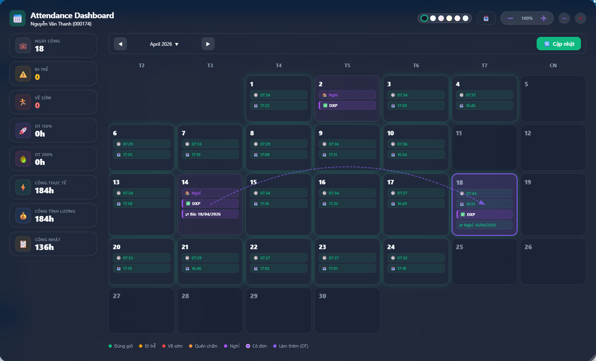 | 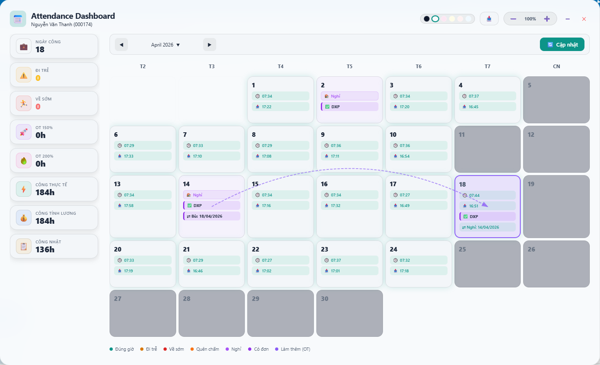 | 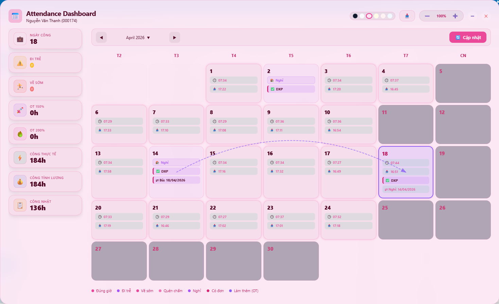 |

| 🌻 Summer Theme | 🍂 Autumn Theme | ❄️ Winter Theme |
| :---: | :---: | :---: |
| 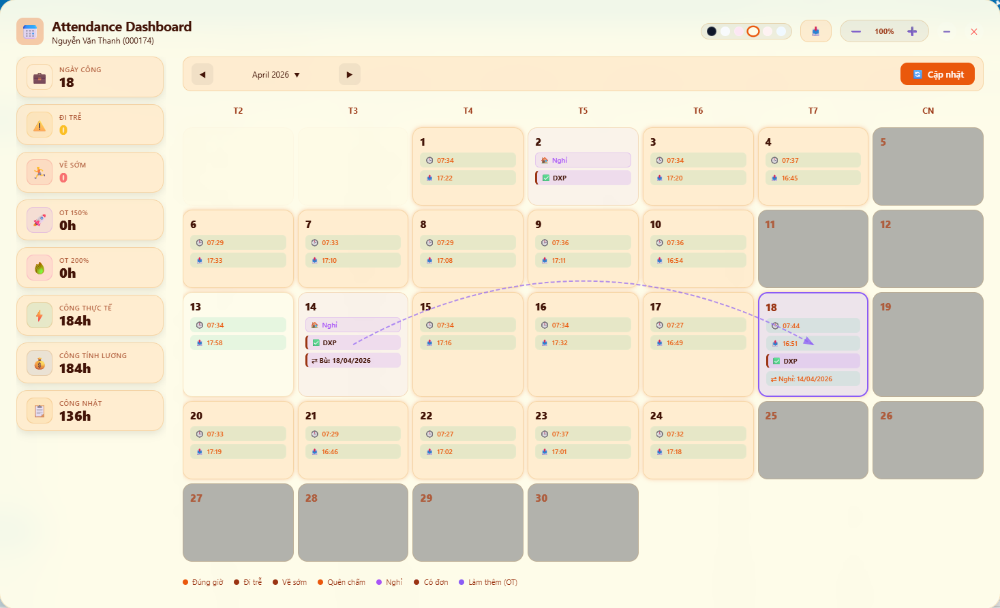 | 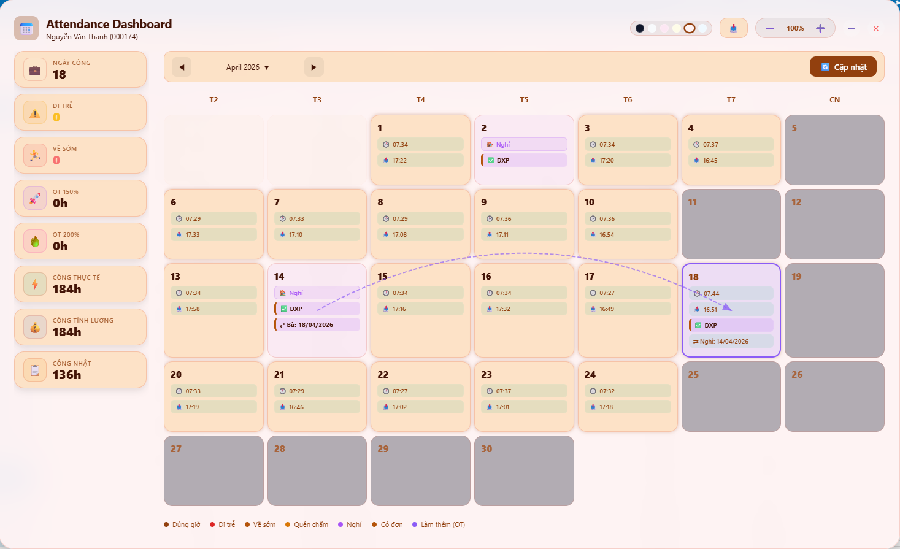 | 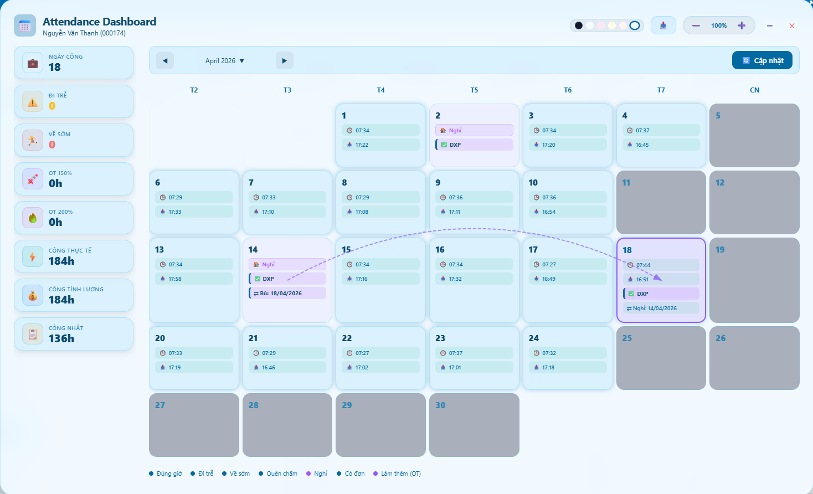 |

### 4. 📊 Tương Tác Dữ Liệu Trực Quan
- **Stats Panel Mở Rộng**: Theo dõi mọi chỉ số quan trọng tại một nơi: Ngày công, Đi trễ, Về sớm, OT 150%/200%, Công thực tế, Công tính lương và Công nhật.
- **Highlight theo thẻ**: Nhấn vào các chỉ số "Nghỉ", "Trễ", "Sớm", "OT"... ở Sidebar để lịch tự động làm nổi bật các ngày vi phạm tương ứng.
- **Bộ chọn Tháng/Năm Premium**: Điều hướng thời gian nhanh chóng với giao diện popup hiện đại thay vì dropdown mặc định nhàm chán.
- **Xuất dữ liệu**: Hỗ trợ xuất báo cáo ngay lập tức cho tháng hiện tại.

---

## 🛠️ Chi Tiết Chức Năng

| Chức năng | Minh họa | Đặc điểm |
| :--- | :---: | :--- |
| **Chi tiết ngày** | 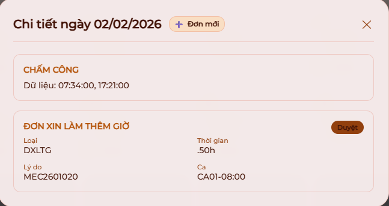 | Hiển thị đầy đủ giờ quẹt thẻ, tên ca, trạng thái đơn từ trong ngày. |
| **Tạo đơn mới** | 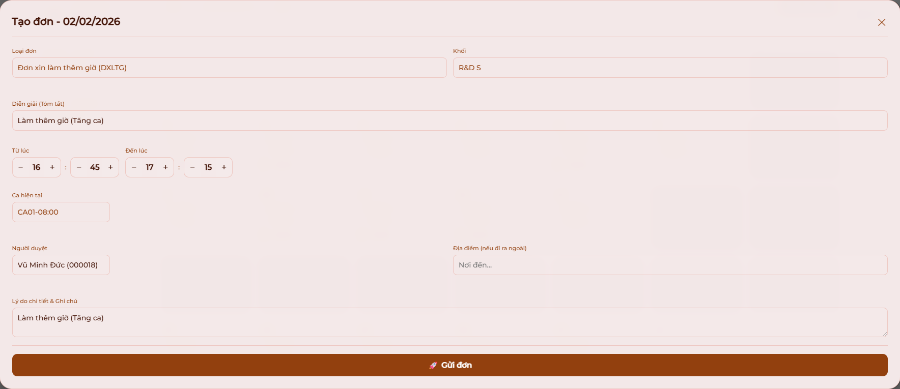 | Giao diện form điền sẵn (Auto-fill) thông minh, hỗ trợ tìm kiếm người duyệt nhanh. |
| **Quản lý đơn** |  | Xem trạng thái duyệt và cho phép xóa đơn trực tiếp ngay tại popup chi tiết. |
| **Chọn tháng** | 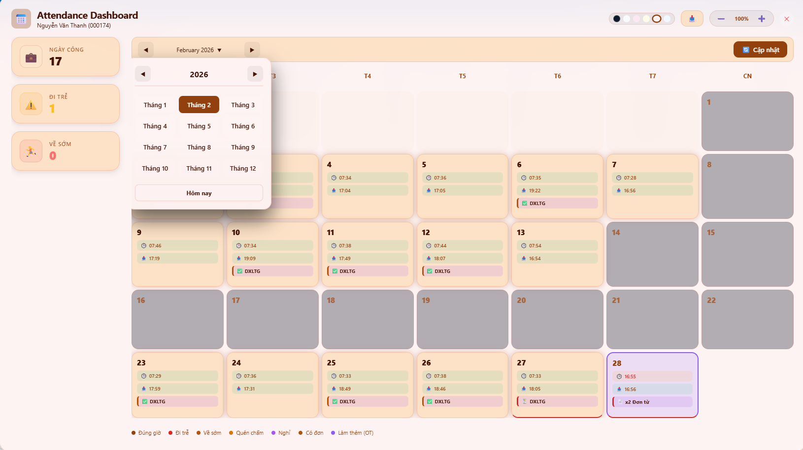 | Popup chọn tháng trực quan, hỗ trợ quay lại năm nhanh và chuyển về "Hôm nay". |
| **Bù phép Drag-Drop** | 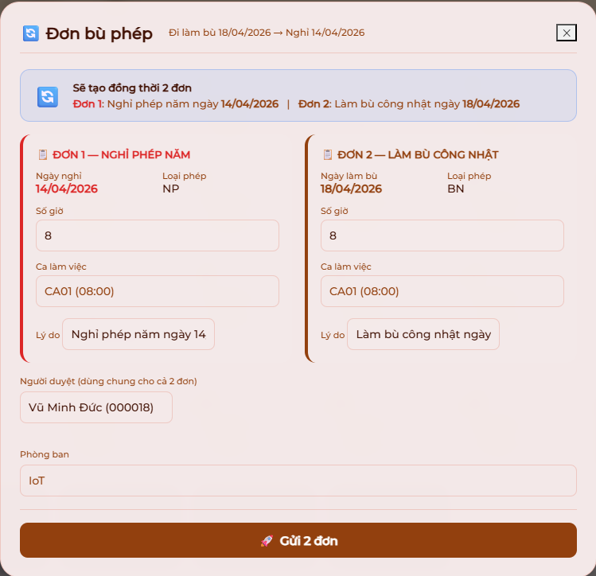 | Kéo ngày OT thả vào ngày nghỉ → tạo 2 đơn NP+BN liên kết tự động. *(Mới v2.3)* |

---

## 💻 Công Nghệ & Kiến Trúc
Dự án được xây dựng với tiêu chí hiệu năng cao và không phụ thuộc thư viện bên ngoài:
- **Core**: Vanilla JavaScript (ES6+) tối ưu tốc độ xử lý DOM.
- **Styling**: CSS Variables kết hợp Backdrop Filter cho hiệu ứng kính mờ (Glass Morphism).
- **Storage**: `chrome.storage.sync` & `localStorage` để đồng bộ cấu hình người dùng (vị trí, kích thước, theme, zoom) và lưu liên kết bù phép (`bpLinks`).
- **Communication**: Interceptor API để giao tiếp mượt mà với backend ASP.NET HRM.
- **SVG Overlay**: Vẽ mũi tên cong động trên lịch để trực quan hóa liên kết NP↔BN.

---

## 🚀 Hướng Dẫn Cài Đặt (Developer Mode)

Cài đặt extension vô cùng đơn giản trong 4 bước:

1. **Bước 1**: Truy cập quản lý Extension trên Edge/Chrome thông qua đường dẫn `edge://extensions`.
2. **Bước 2**: Bật **Developer mode** (Chế độ nhà phát triển) ở góc màn hình.
3. **Bước 3**: Nhấn nút **Load unpacked** (Tải bản tiện ích đã giải nén).
4. **Bước 4**: Chọn thư mục `` trong máy tính của bạn.

*(Lưu ý: Luôn login vào hệ thống HRM trước khi sử dụng extension)*

---

**Made with ❤️ by Syo & Antigravity for Asoft HRM Efficiency**